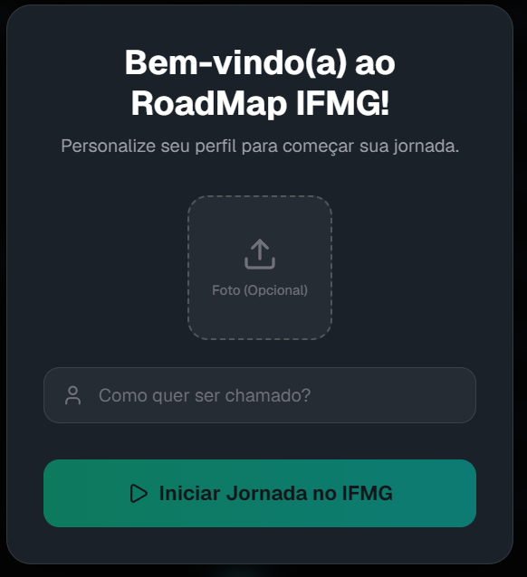
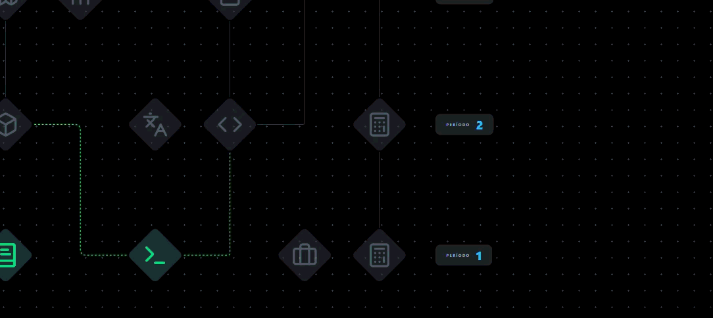

# 🗺️ Roadmap IFMG

[](https://roadmap-ifmg.vercel.app/)

Bem-vindo ao **Roadmap IFMG**, uma aplicação web interativa desenvolvida para ajudar os alunos do Instituto Federal de Minas Gerais (IFMG) a visualizarem, gerenciarem e planejarem o seu progresso acadêmico. Com base em um mapa visual de habilidades (Skills Map), o aluno pode acompanhar trilhas de carreira e ver exatamente como cada disciplina se conecta com o seu futuro profissional.

---

## 🚀 Funcionalidades

- **Mapa de Conhecimento Interativo:** Explore a grade curricular através de uma interface baseada em grafos, onde cada disciplina é um *node* (nó) e as conexões representam os pré-requisitos lógicos.
- **Sistema de Pré-Requisitos Dinâmico:** Tentar marcar uma disciplina avançada sem ter a base? A aplicação emite um alerta visual (fio de energia vermelho piscante) mostrando exatamente qual pré-requisito está faltando.
- **Trilhas de Carreira Profissionais:** Descubra quais matérias você precisa concluir para se tornar um Desenvolvedor Web, Cientista de Dados, Arquiteto de Software, entre outros. O mapa ilumina a trilha para você!
- **Feedback Automático:** Toda vez que você concluir 100% dos requisitos de uma Trilha de Carreira, a câmera foca automaticamente no seu Avatar com uma celebração visual da nova profissão adquirida.

---

## 🛠️ Tecnologias Utilizadas

- **[Next.js](https://nextjs.org/)** (React framework)
- **[React Flow / xyflow](https://reactflow.dev/)** (Motor de renderização do mapa de nós e arestas)
- **[Zustand](https://zustand-demo.pmnd.rs/)** (Gerenciamento de estado global extremamente rápido e leve)
- **[Tailwind CSS](https://tailwindcss.com/)** (Estilização avançada com Glassmorphism e Dark Mode nativo)
- **[Framer Motion](https://www.framer.com/motion/)** (Animações complexas de entrada, transição e hover)
- **[Lucide React](https://lucide.dev/)** (Ícones SVG super otimizados e consistentes)

---

## 💻 Como Rodar o Projeto Localmente

### Pré-requisitos
Certifique-se de ter o **Node.js** (versão 18+ recomendada) instalado na sua máquina.

### Passo a passo

1. **Clone o repositório:**
   ```bash
   git clone https://github.com/SeuUsuario/roadmap-ifmg.git
   cd roadmap-ifmg
   ```

2. **Instale as dependências:**
   Você pode usar npm, yarn ou pnpm.
   ```bash
   npm install
   ```

3. **Inicie o servidor de desenvolvimento:**
   ```bash
   npm run dev
   ```

4. **Acesse a aplicação:**
   Abra o seu navegador e acesse: [http://localhost:3000](http://localhost:3000)

---

## 📖 Tutorial Rápido de Uso

### 1. Tela Inicial e Onboarding
Assim que abrir a página, você será recebido por um **Modal de Boas-Vindas**.

- Digite o seu **Nome** (Obrigatório).
- Adicione uma **Foto** se desejar (Opcional). Se você não colocar a foto, o sistema utilizará a logo oficial do IFMG como imagem de perfil padrão.
- Clique em **"Iniciar Jornada no IFMG"**.



### 2. Explorando as Disciplinas (Cards / Nodes)

O Mapa é composto por "Losangos" (Cards) que representam as disciplinas do curso separadas por Períodos (Ex: 1º Período, 2º Período...).
- **Modo Compacto / Expandido:** No canto superior direito, há o botão `Expandir Cards`. Clique nele para expandir os cartões e ler detalhes extras.


- **Ativar Disciplina:** Clique em uma matéria para marcá-la como concluída (ela ficará verde e o raio de conexão se acenderá).


- **Aviso de Pré-Requisito:** Se você clicar em *Estrutura de Dados II* sem ter feito a *I*, um fio vermelho vibrante apontará a matéria faltante.


### 3. As Trilhas de Carreira (SidePanel Esquerdo)

No lado esquerdo, existe um painel expansível de Trilhas de Carreira:
- Clique em **Trilhas de Carreira** para abrir o menu lateral.
- Selecione uma profissão que te interessa e clique nela.  (Ex: "Desenvolvedor Backend").
- O painel listará todas as matérias que você precisa cursar. 
- Clique em "Quero Aprender" 
- **O Caminho Amarelo:** Automaticamente, o sistema desenhará cabos amarelos no mapa traçando a rota exata desde o início até o fim daquela profissão!


### 4. Perfil do Usuário

- O seu Avatar fica fixo na base da skill tree.
- Conforme você completa uma trilha inteira (ex: todas as matérias de Cientista de Dados), o sistema automaticamente desliza a câmera até você e mostra uma **Badge com o nome da Profissão** animada e surgindo abaixo da sua foto!
- **Alterar Foto ou Nome:** A qualquer momento, passe o mouse na foto do seu Avatar para atualizar sua foto, ou no seu nome para editar.


---


